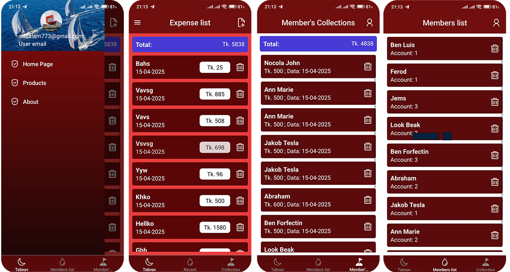

# 💸 Expense Tracker App

A simple and efficient Expense Tracker application built with React (or React Native), using **Redux** for state management and **SQLite** for local data storage. This app allows users to track income and expenses, categorize transactions, and view summaries.


## 🧠 Features

- 📝 Add, edit, and delete income/expense transactions
- 📂 Categorize expenses
- 📊 View expense and income summaries
- 💾 Offline-first with persistent storage using SQLite
- ⚛️ Global state management with Redux
- 📱 (Optional) Mobile support with React Native

## 🚀 Screens



## 🛠️ Tech Stack

- **Frontend**: React / React Native
- **State Management**: Redux / Redux Toolkit
- **Database**: SQLite (via `react-native-sqlite-storage` or `better-sqlite3` for desktop)
- **Middleware**: Redux Thunk (for async operations)

## 🚀 Getting Started

### Prerequisites

- Node.js
- npm or yarn
- (If React Native) Expo CLI or React Native CLI
- SQLite dev dependencies installed (based on your platform)

### Installation

1. **Clone the repository**
   ```bash
   git clone https://github.com/mdtaslimkhan/expense.git
   cd expense-tracker-app
   ```

2. **Install dependencies**
   ```bash
   npm install
   # or
   yarn install
   ```

3. **Run the app**

   - For web:
     ```bash
     npm start
     ```

   - For React Native:
     ```bash
     npx react-native run-android
     # or
     npx react-native run-ios
     ```

## 🧩 Folder Structure

```
src/
├── components/       # Reusable UI components
├── screens/          # App screens/pages
├── redux/            # Redux setup (actions, reducers, store)
│   ├── actions/
│   ├── reducers/
│   └── store.js
├── database/         # SQLite database setup and queries
├── utils/            # Utility functions
└── App.js
```


## 💽 SQLite Setup

- The app initializes a local SQLite database on launch.
- Transactions are stored persistently and loaded into Redux on startup.
- CRUD operations are performed both in Redux and SQLite to keep them in sync.

## 📦 Future Enhancements

- Cloud sync (Firebase / Supabase)
- User authentication
- Dark mode
- Graphs & charts for analytics

## 🤝 Contributing

Contributions, issues and feature requests are welcome!

1. Fork the repo
2. Create your feature branch (`git checkout -b feature/AmazingFeature`)
3. Commit your changes (`git commit -m 'Add some AmazingFeature'`)
4. Push to the branch (`git push origin feature/AmazingFeature`)
5. Open a Pull Request

## 📄 License

This project is licensed under the MIT License - see the [LICENSE](LICENSE) file for details.

---

Made with ❤️ by [Your Name](https://github.com/mdtaslimkhan)
- Project Link: (https://github.com/mdtaslimkhan/expense)
```

---

Let me know if you're using **React Native**, **Electron**, or anything else specific — I can tailor the README further for that setup.